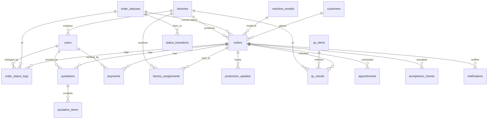
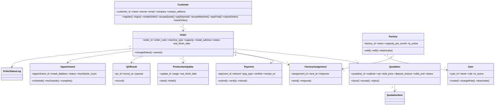
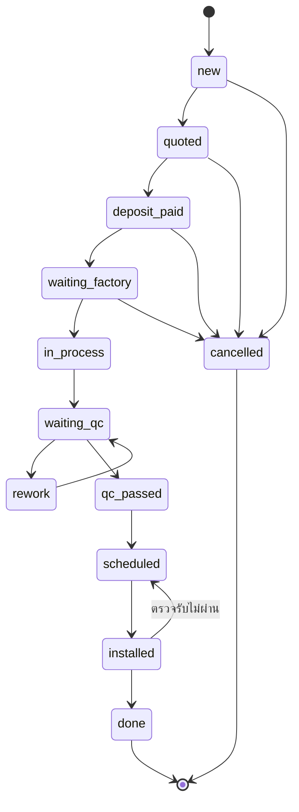
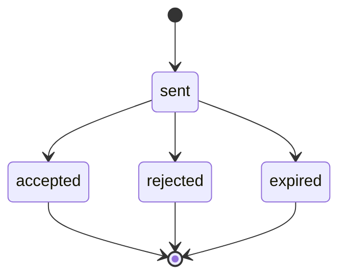
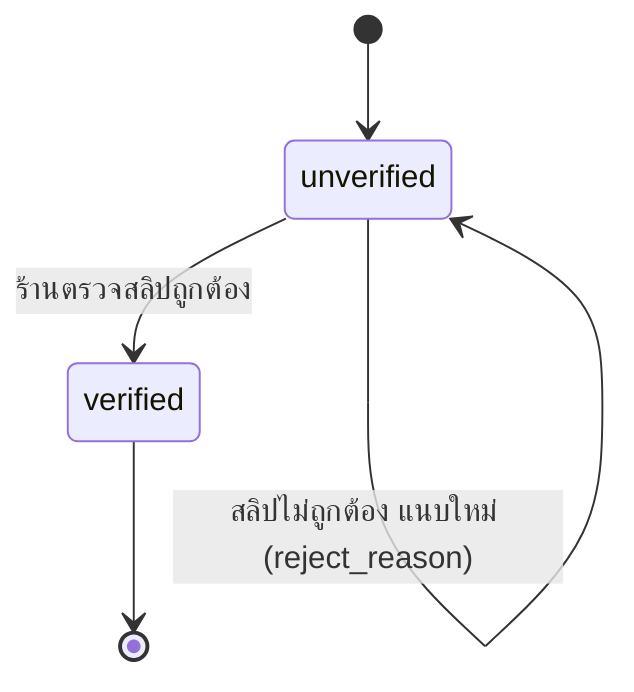
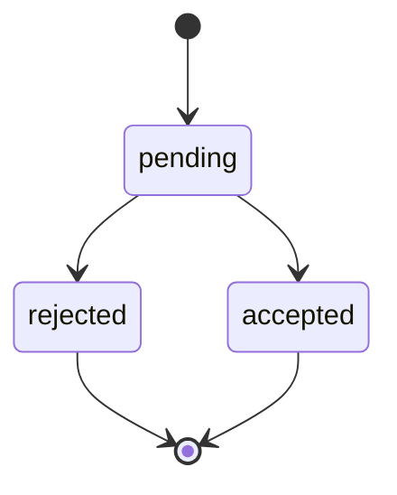
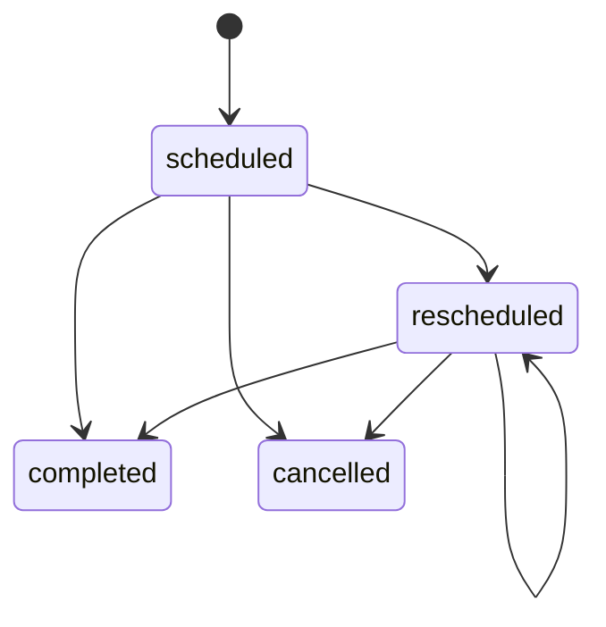
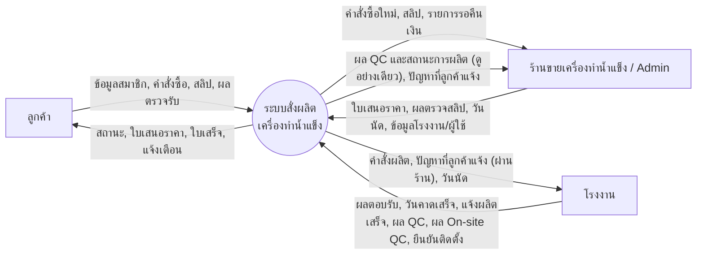

# ร่างบทที่ 2, 4, 5 — ระบบสั่งผลิตเครื่องทำน้ำแข็ง

> ร่างตามโครงของเล่มตัวอย่าง "SA กลุ่ม 9" (ร้านตัดผม)
> - เลข Use Case ใช้ตาม Word เล่มปัจจุบัน (UC1–UC15)
> - ชื่อตาราง/คอลัมน์/สถานะ/ค่ากฎธุรกิจ ดึงจากฐานข้อมูลจริง (Supabase ICEFLOW) ไม่ได้เขียนขึ้นเอง
> - ตัวเลขที่ใส่ `[…]` และรูปภาพ (ภาพที่ …) ต้องใส่เอง
> - **ข้อควรตัดสินใจ** ท้ายไฟล์

---

# บทที่ 2

## 2.1 Business Process เดิม

[ภาพที่ 2.1 แสดง Business Process เดิม]  ← swimlane 3 ช่อง: ลูกค้า / ร้านขายเครื่องทำน้ำแข็ง / โรงงาน

### 2.1.1 คำอธิบาย Business Process เดิม

กระบวนการเริ่มจากลูกค้าติดต่อร้านขายเครื่องทำน้ำแข็งโดยตรง (โทรศัพท์ แชต หรือเข้าหน้าร้าน) เพื่อแจ้งประเภทเครื่อง ขนาด/กำลังผลิต และสถานที่ติดตั้ง ร้านจะประเมินราคาแล้วแจ้งลูกค้าด้วยวาจาหรือข้อความ เมื่อลูกค้าตกลงจึงโอนเงินมัดจำ และร้านส่งรายละเอียดให้โรงงานผู้ผลิตทางโทรศัพท์หรือแชต

ระหว่างการผลิต ร้านต้องติดต่อโรงงานเพื่อสอบถามความคืบหน้า และแจ้งลูกค้าต่ออีกทอดหนึ่ง เมื่อผลิตเสร็จ ร้านนัดวันติดตั้งกับลูกค้าและโรงงาน หลังติดตั้ง ลูกค้าตรวจรับและชำระยอดคงเหลือ ข้อมูลทั้งหมดอยู่ในบทสนทนาและความจำของบุคคล ไม่มีที่เก็บกลาง

### 2.1.2 ปัญหาของ Business Process เดิม

1. **ลูกค้าไม่สามารถตรวจสอบสถานะคำสั่งซื้อได้เอง**
   ต้องโทรถามร้านทุกครั้ง และร้านต้องโทรถามโรงงานต่อ
   [ตัวอย่างการคำนวณ: ถามเฉลี่ย __ ครั้ง/คำสั่งซื้อ × __ นาที × __ คำสั่งซื้อ/เดือน = __ ชั่วโมง/เดือน]

2. **ข้อมูลกระจายหลายช่องทาง ย้อนดูไม่ได้**
   ราคา เงื่อนไข ยอดมัดจำ และวันนัดอยู่ในแชต/สลิปรูปภาพ เมื่อมีหลายคำสั่งซื้อพร้อมกันเกิดความคลาดเคลื่อนได้
   [ตัวอย่าง: ใบเสนอราคาไม่ตรงกับที่ตกลง, สลิปหาย]

3. **ไม่มีกำหนดเวลาที่ชัดเจนกับโรงงาน**
   ไม่มีการบันทึกว่าส่งงานเมื่อไร และโรงงานตอบรับหรือปฏิเสธเมื่อไร งานอาจค้างโดยร้านไม่รู้

4. **ไม่มีเกณฑ์ตรวจคุณภาพ (QC) ที่บันทึกไว้**
   ผลตรวจก่อนติดตั้งอยู่ที่ตัวบุคคล เมื่อเกิดปัญหาหลังติดตั้งตรวจสอบย้อนหลังไม่ได้

5. **การคืนมัดจำไม่เป็นระบบ**
   เมื่อยกเลิกหรือไม่มีโรงงานรับผลิต ไม่มีหลักฐานการคืนเงิน

## 2.2 Business Process ใหม่

[ภาพที่ 2.2 แสดง Business Process ใหม่]

### 2.2.1 คำอธิบาย Business Process ใหม่

ระบบทำหน้าที่เป็นศูนย์กลางระหว่างลูกค้า ร้าน และโรงงาน (ร้านยังเป็นตัวกลางตามเดิม ระบบไม่ได้ตัดร้านออก)

1. ลูกค้าสมัครสมาชิก/เข้าสู่ระบบ เลือกรุ่นเครื่องจากแคตตาล็อก กรอกสถานที่ติดตั้ง กำลังไฟ และพื้นที่ แล้วระบบสร้างคำสั่งซื้อพร้อมเลข Order (สถานะ `new`)
2. ร้านออกใบเสนอราคา (ราคา VAT ยอดมัดจำ วันหมดอายุ) ระบบแจ้งลูกค้า (`quoted`) ลูกค้ายอมรับแล้วชำระมัดจำพร้อมแนบสลิป ร้านตรวจสลิป (`deposit_paid`)
3. ร้านเลือกโรงงานและส่งคำสั่งผลิต (`waiting_factory`) โรงงานต้องตอบรับหรือปฏิเสธภายใน 3 วัน หากปฏิเสธ ร้านเลือกโรงงานใหม่
4. โรงงานเริ่มผลิตและระบุวันที่คาดว่าจะเสร็จ (`in_process`) ลูกค้าเห็นวันคาดการณ์จากระบบ เมื่อเสร็จแจ้งในระบบ (`waiting_qc`)
5. **QC ระหว่างการผลิต ตรวจโดยโรงงานเท่านั้น:** โรงงานตรวจตามรายการ QC และบันทึกผลในระบบ ร้านและลูกค้าดูผลได้แต่ไม่ได้เป็นผู้ตรวจ ผ่านทุกหัวข้อจึงเป็น `qc_passed` หากไม่ผ่านโรงงานแก้ไข (`rework`) แล้วส่งตรวจรอบใหม่ (ไม่เกิน `max_qc_rounds`)
6. ร้านนัดวันติดตั้งร่วมกับลูกค้าและโรงงาน (`scheduled`) สามารถเลื่อนนัดได้ โรงงานยืนยันว่าติดตั้งเสร็จ (`installed`)
7. **ตรวจหลังติดตั้ง:** เมื่อติดตั้งเสร็จ โรงงานตรวจ On-site QC อีกครั้งที่หน้างานและบันทึกผล แล้วกดยืนยันติดตั้งเสร็จ (`installed`) จากนั้นลูกค้าตรวจรับเอง หากผ่านก็ชำระยอดคงเหลือ ร้านตรวจสลิปแล้วระบบออกใบเสร็จ (`done`) หากพบปัญหา **ลูกค้าแจ้งร้าน ร้านเป็นผู้ประสานโรงงาน** แล้วนัดเข้าแก้ไขใหม่ (`scheduled`) และลูกค้าตรวจรับอีกครั้ง
8. ลูกค้าหรือร้านยกเลิกได้ก่อนเริ่มผลิต (`cancelled`) หากมีเงินมัดจำ ระบบเข้าสู่การคืนมัดจำ

ทุกครั้งที่สถานะเปลี่ยน ระบบบันทึกประวัติ (`order_status_logs`) และแจ้งเตือนผู้เกี่ยวข้อง (`notifications`) ลูกค้าติดตามความคืบหน้าได้เองจาก Timeline

**ขอบเขต:** การขนส่งและการลงมือติดตั้งจริงทำโดยโรงงานนอกระบบ ระบบบันทึกเพียงวันนัดและการยืนยันว่าติดตั้งเสร็จ งานหลังการขาย/เคลม อยู่นอกขอบเขต

**กฎธุรกิจที่ระบบใช้** (ตาราง `business_rules`)

| กฎ | ค่า | ความหมาย |
|---|---|---|
| deposit_percent | 40 | มัดจำเป็น % ของราคารวม |
| quote_valid_days | 7 | ใบเสนอราคามีอายุ (วัน) |
| factory_reply_days | 3 | โรงงานต้องตอบภายใน (วัน) |
| max_qc_rounds | 3 | จำนวนรอบ QC ที่ไม่ผ่านได้ ก่อนพิจารณาโรงงานอื่น |
| final_payment_days | 7 | ชำระยอดคงเหลือภายใน (วัน) หลังตรวจรับ |
| reschedule_notice_days | 1 | แจ้งล่วงหน้าเพื่อเลื่อนนัด (วัน) |

## 2.3 Business Process ที่สัมพันธ์กับ Use Case

[ภาพที่ 2.3 แสดง Business Process ที่สัมพันธ์กับ Use Case]  ← swimlane เดิม ใส่หมายเลข BP 1–9 ที่แต่ละขั้น

## 2.4 ตารางการจับคู่ระหว่าง Business Process และ Use Case Diagram

| Business Process | Use Case | ตัวแสดง |
|---|---|---|
| 1 สมัคร/เข้าสู่ระบบ | UC1 | ลูกค้า |
| 2 สร้างคำสั่งซื้อ | UC2 | ลูกค้า |
| 3 เสนอราคาและชำระมัดจำ | UC3 | ร้าน, ลูกค้า |
| 4 ส่งคำสั่งผลิต / เลือกโรงงานใหม่ | UC4, UC5 | ร้าน, โรงงาน |
| 5 ผลิตและแจ้งผลิตเสร็จ | UC6 | โรงงาน |
| 6 ตรวจ QC และแก้ไข | UC7 | โรงงาน (ร้านดูผลเท่านั้น) |
| 7 นัดติดตั้ง ติดตั้ง ตรวจ On-site QC และยืนยันติดตั้งเสร็จ | UC8, UC9 | ร้าน, ลูกค้า, โรงงาน (โรงงานตรวจ On-site QC) |
| 8 ลูกค้าตรวจรับ (หากมีปัญหาแจ้งร้าน ร้านประสานโรงงาน) ชำระยอดคงเหลือ ออกใบเสร็จ | UC10 | ลูกค้า, ร้าน, โรงงาน |
| 9 ยกเลิกและคืนมัดจำ | UC11, UC12 | ลูกค้า, ร้าน |
| (ทุกขั้น) ติดตามสถานะ | UC13 | ลูกค้า |
| (สนับสนุน) จัดการโรงงาน / ผู้ใช้และสิทธิ์ | UC14, UC15 | Admin |

ตารางที่ 2.1 แสดงการจับคู่ระหว่าง Business Process และ Use Case Diagram

---

# บทที่ 4

## 4.1 ER Diagram

[ภาพที่ 4.1 แสดง ER Diagram] — วาดจาก Mermaid ด้านล่าง (วางที่ mermaid.live แล้วส่งออกเป็นรูป)

**หมายเหตุ:** `business_rules` ไม่มีความสัมพันธ์กับตารางอื่น (ตารางค่าคงที่) ส่วน `notifications` ใช้ `recipient_type` + `recipient_id` แทน FK ตรง

## 4.2 ER Diagram ที่มี Query

[ภาพที่ 4.2 แสดง ER Diagram ที่มี Query] — ER เดียวกับ 4.1 แต่ติดป้าย Q1.1, Q2.1 … ที่ตารางที่ Query นั้นใช้

## 4.3 Query Table

> ตามกติกาของวิชา: ระบุชื่อคอลัมน์ ไม่ใช้ `*` และใช้ `?` / `:param` แทนค่า

| Query | UC | ชื่อ UC | SQL Command |
|---|---|---|---|
| Q1.1 | 1 | สมัครสมาชิก | `SELECT COUNT(c.customer_id) FROM customers c WHERE c.email = :email OR c.phone = :phone;` |
| Q1.2 | 1 | สมัครสมาชิก | `INSERT INTO customers (auth_id, name, phone, email, created_at) VALUES (:auth_id, :name, :phone, :email, NOW());` |
| Q1.3 | 1 | เข้าสู่ระบบ | `SELECT c.customer_id, c.name, c.is_active FROM customers c WHERE c.auth_id = :auth_id;` |
| Q2.1 | 2 | สร้างคำสั่งซื้อ | `SELECT m.model_id, m.code, m.name, m.machine_type, m.capacity, m.price FROM machine_models m WHERE m.is_active = true;` |
| Q2.2 | 2 | สร้างคำสั่งซื้อ | `INSERT INTO orders (order_code, customer_id, model_id, machine_type, capacity, install_address, install_power, install_space, status, created_at) VALUES (:order_code, :customer_id, :model_id, :machine_type, :capacity, :install_address, :install_power, :install_space, 0, NOW());` |
| Q2.3 | 2 | สร้างคำสั่งซื้อ | `INSERT INTO order_status_logs (order_id, status, changed_by, changed_at) VALUES (:order_id, 0, NULL, NOW());` |
| Q3.1 | 3 | ออกใบเสนอราคา | `SELECT o.order_id, o.order_code, o.machine_type, o.capacity, o.install_address, o.status FROM orders o WHERE o.status = 0;` |
| Q3.2 | 3 | ออกใบเสนอราคา | `INSERT INTO quotations (order_id, subtotal, vat, total_price, deposit_amount, valid_until, status, created_by, created_at) VALUES (:order_id, :subtotal, :vat, :total_price, :deposit_amount, :valid_until, 'sent', :user_id, NOW());` |
| Q3.3 | 3 | ออกใบเสนอราคา | `INSERT INTO quotation_items (quotation_id, description, amount) VALUES (:quotation_id, :description, :amount);` |
| Q3.4 | 3 | ออกใบเสนอราคา | `UPDATE orders SET status = 1 WHERE order_id = :order_id;` |
| Q3.5 | 3 | ยอมรับราคา | `UPDATE quotations SET status = 'accepted', responded_at = NOW() WHERE quotation_id = :quotation_id;` |
| Q3.6 | 3 | ชำระมัดจำ | `INSERT INTO payments (order_id, amount, pay_type, payment_method, slip_path, verified, paid_at) VALUES (:order_id, :amount, 'deposit', :method, :slip_path, false, NOW());` |
| Q3.7 | 3 | ตรวจสลิปมัดจำ | `UPDATE payments SET verified = true, verified_by = :user_id WHERE payment_id = :payment_id;` |
| Q3.8 | 3 | ตรวจสลิปมัดจำ | `UPDATE orders SET status = 2 WHERE order_id = :order_id;` |
| Q4.1 | 4 | ส่งคำสั่งผลิต | `SELECT f.factory_id, f.name, f.capacity_per_month FROM factories f WHERE f.is_active = true;` |
| Q4.2 | 4 | ส่งคำสั่งผลิต | `INSERT INTO factory_assignments (order_id, factory_id, sent_by, sent_at, response) VALUES (:order_id, :factory_id, :user_id, NOW(), 'pending');` |
| Q4.3 | 4 | ส่งคำสั่งผลิต | `UPDATE orders SET status = 3, factory_id = :factory_id, sent_at = NOW() WHERE order_id = :order_id;` |
| Q4.4 | 4 | โรงงานตอบรับ | `UPDATE factory_assignments SET response = :response, reject_reason = :reason, responded_at = NOW() WHERE assignment_id = :assignment_id;` |
| Q4.5 | 4 | แจ้งเตือนโรงงานไม่ตอบ | `SELECT fa.assignment_id, fa.order_id, fa.sent_at FROM factory_assignments fa WHERE fa.response = 'pending' AND fa.sent_at < NOW() - (:factory_reply_days * INTERVAL '1 day');` |
| Q5.1 | 5 | เลือกโรงงานใหม่ | `SELECT f.factory_id, f.name FROM factories f WHERE f.is_active = true AND f.factory_id NOT IN (SELECT fa.factory_id FROM factory_assignments fa WHERE fa.order_id = :order_id AND fa.response = 'rejected');` |
| Q5.2 | 5 | เลือกโรงงานใหม่ | `UPDATE orders SET factory_id = :new_factory_id, sent_at = NOW() WHERE order_id = :order_id;` |
| Q6.1 | 6 | เริ่มผลิต | `UPDATE orders SET status = 4, started_at = NOW(), est_finish_date = :est_finish_date WHERE order_id = :order_id;` |
| Q6.2 | 6 | เริ่มผลิต | `INSERT INTO production_updates (order_id, stage, est_finish_date, note, updated_by, created_at) VALUES (:order_id, :stage, :est_finish_date, :note, :user_id, NOW());` |
| Q6.3 | 6 | แจ้งผลิตเสร็จ | `UPDATE orders SET status = 5, finished_at = NOW() WHERE order_id = :order_id;` |
| Q7.1 | 7 | ตรวจ QC | `SELECT qi.item_id, qi.item_name FROM qc_items qi WHERE qi.is_active = true;` |
| Q7.2 | 7, 9 | ตรวจ QC (โรงงาน) / On-site QC หลังติดตั้ง | `INSERT INTO qc_results (order_id, factory_id, round_no, item_id, stage, passed, note, checked_by, checked_at) VALUES (:order_id, :factory_id, :round_no, :item_id, :stage, :passed, :note, :user_id, NOW());`  (`stage` = 'production' หรือ 'onsite', **คอลัมน์ใหม่ที่เสนอ**) |
| Q7.3 | 7, 9 | ตรวจผลรวมของรอบ | `SELECT COUNT(q.qc_id) FROM qc_results q WHERE q.order_id = :order_id AND q.stage = :stage AND q.round_no = :round_no AND q.passed = false;` |
| Q7.4 | 7 | QC ผ่าน/ไม่ผ่าน | `UPDATE orders SET status = :status WHERE order_id = :order_id;`  (`:status` = 7 ผ่าน, 6 ไม่ผ่าน) |
| Q8.1 | 8 | นัดวันติดตั้ง | `INSERT INTO appointments (order_id, install_datetime, status, created_by, created_at) VALUES (:order_id, :install_datetime, 'scheduled', :user_id, NOW());` |
| Q8.2 | 8 | นัดวันติดตั้ง | `UPDATE orders SET status = 8 WHERE order_id = :order_id;` |
| Q8.3 | 8 | เลื่อนนัด | `UPDATE appointments SET install_datetime = :new_datetime, status = 'rescheduled', reschedule_count = reschedule_count + 1, reschedule_reason = :reason WHERE appointment_id = :appointment_id;` |
| Q9.1 | 9 | ยืนยันติดตั้งเสร็จ | `UPDATE orders SET status = 9, installed_at = NOW() WHERE order_id = :order_id;` |
| Q9.2 | 9 | ยืนยันติดตั้งเสร็จ | `UPDATE appointments SET status = 'completed' WHERE order_id = :order_id AND status IN ('scheduled', 'rescheduled');` |
| Q10.1 | 10 | ลูกค้าตรวจรับ (ไม่ผ่าน = แจ้งปัญหาถึงร้าน) | `INSERT INTO acceptance_checks (order_id, passed, note, checked_at) VALUES (:order_id, :passed, :note, NOW());` |
| Q10.2 | 10 | ชำระยอดคงเหลือ | `INSERT INTO payments (order_id, amount, pay_type, payment_method, slip_path, verified, paid_at) VALUES (:order_id, :amount, 'final', :method, :slip_path, false, NOW());` |
| Q10.3 | 10 | ตรวจสลิป/ออกใบเสร็จ | `UPDATE payments SET verified = true, verified_by = :user_id, receipt_no = :receipt_no WHERE payment_id = :payment_id;` |
| Q10.4 | 10 | ปิดคำสั่งซื้อ | `UPDATE orders SET status = 10, accepted_at = NOW() WHERE order_id = :order_id;` |
| Q11.1 | 11 | ยกเลิกคำสั่งซื้อ | `UPDATE orders SET status = 99, cancel_reason = :reason, cancelled_by = :by, cancelled_at = NOW() WHERE order_id = :order_id;` |
| Q12.1 | 12 | คืนมัดจำ | `SELECT p.payment_id, p.amount FROM payments p WHERE p.order_id = :order_id AND p.pay_type = 'deposit' AND p.verified = true;` |
| Q12.2 | 12 | คืนมัดจำ | `INSERT INTO payments (order_id, amount, pay_type, payment_method, slip_path, refund_account, verified, verified_by, paid_at) VALUES (:order_id, :amount, 'refund', 'transfer', :slip_path, :refund_account, true, :user_id, NOW());` |
| Q13.1 | 13 | ติดตามสถานะ | `SELECT o.order_id, o.order_code, o.machine_type, os.name AS status_name, o.est_finish_date FROM orders o JOIN order_statuses os ON o.status = os.status_code WHERE o.customer_id = :customer_id;` |
| Q13.2 | 13 | ติดตามสถานะ | `SELECT l.status, os.name AS status_name, l.note, l.changed_at FROM order_status_logs l JOIN order_statuses os ON l.status = os.status_code WHERE l.order_id = :order_id ORDER BY l.changed_at;` |
| Q14.1 | 14 | จัดการโรงงาน | `SELECT f.factory_id, f.name, f.contact_name, f.phone, f.capacity_per_month, f.is_active FROM factories f;` |
| Q14.2 | 14 | จัดการโรงงาน | `INSERT INTO factories (name, contact_name, phone, capacity_per_month, is_active) VALUES (:name, :contact_name, :phone, :capacity, true);` |
| Q14.3 | 14 | จัดการโรงงาน | `UPDATE factories SET name = :name, contact_name = :contact_name, phone = :phone, capacity_per_month = :capacity, is_active = :is_active WHERE factory_id = :factory_id;` |
| Q15.1 | 15 | จัดการผู้ใช้ | `SELECT u.user_id, u.name, u.email, u.role, u.factory_id, u.is_active FROM users u;` |
| Q15.2 | 15 | จัดการผู้ใช้ | `INSERT INTO users (auth_id, name, email, role, factory_id, is_active) VALUES (:auth_id, :name, :email, :role, :factory_id, true);` |
| Q15.3 | 15 | จัดการผู้ใช้ | `UPDATE users SET role = :role, factory_id = :factory_id, is_active = :is_active WHERE user_id = :user_id;` |

> ใน DB จริง การเปลี่ยนสถานะ (Q3.4, Q3.8, Q4.3 ฯลฯ) ถูกตรวจโดย trigger `trg_check_status` กับตาราง `status_transitions` และเขียน `order_status_logs` + `notifications` อัตโนมัติ การดำเนินการของลูกค้าบางอย่างผ่าน RPC (`customer_accept_quote`, `customer_cancel_order`, `customer_submit_acceptance`) ตารางข้างบนเขียนเป็น SQL ตรงเพื่อให้ตรงกับรูปแบบของวิชา

## 4.4 Table Structure

> PK = Primary Key, FK = Foreign Key, UQ = Unique, NN = Not Null

### 4.4.1 customers
| Column | Type | Key | NN | หมายเหตุ |
|---|---|---|---|---|
| customer_id | bigint | PK | ✔ | identity |
| auth_id | uuid | FK→auth.users, UQ | | บัญชีเข้าสู่ระบบ |
| name | text | | ✔ | |
| phone | text | | ✔ | |
| email | text | UQ | ✔ | |
| company | text | | | |
| contact_address | text | | | |
| is_active | boolean | | ✔ | default true |
| created_at | timestamptz | | ✔ | default now() |

### 4.4.2 users (พนักงานร้าน / โรงงาน / admin)
| Column | Type | Key | NN | หมายเหตุ |
|---|---|---|---|---|
| user_id | bigint | PK | ✔ | identity |
| auth_id | uuid | FK→auth.users, UQ | | |
| name | text | | ✔ | |
| email | text | UQ | ✔ | |
| role | text | | ✔ | `admin` / `shop` / `factory` |
| factory_id | bigint | FK→factories | | ใช้เมื่อ role = factory |
| is_active | boolean | | ✔ | default true |
| created_at | timestamptz | | ✔ | |

### 4.4.3 factories
| Column | Type | Key | NN | หมายเหตุ |
|---|---|---|---|---|
| factory_id | bigint | PK | ✔ | identity |
| name | text | | ✔ | |
| contact_name | text | | | |
| phone | text | | | |
| capacity_per_month | integer | | | ≥ 0 |
| is_active | boolean | | ✔ | default true |

### 4.4.4 machine_models
| Column | Type | Key | NN | หมายเหตุ |
|---|---|---|---|---|
| model_id | bigint | PK | ✔ | identity |
| code | text | UQ | ✔ | เช่น IF-T05 |
| name | text | | ✔ | |
| machine_type | text | | ✔ | |
| capacity | text | | ✔ | |
| price | numeric | | ✔ | ≥ 0 |
| description | text | | | |
| is_active | boolean | | ✔ | default true |

### 4.4.5 orders
| Column | Type | Key | NN | หมายเหตุ |
|---|---|---|---|---|
| order_id | bigint | PK | ✔ | identity |
| order_code | text | UQ | | เลข Order |
| customer_id | bigint | FK→customers | ✔ | |
| model_id | bigint | FK→machine_models | | |
| factory_id | bigint | FK→factories | | โรงงานปัจจุบัน |
| machine_type | text | | ✔ | |
| capacity | text | | ✔ | |
| install_address | text | | ✔ | |
| install_power | text | | | |
| install_space | text | | | |
| status | smallint | FK→order_statuses | ✔ | default 0 |
| sent_at | timestamptz | | | ส่งโรงงาน |
| started_at | timestamptz | | | เริ่มผลิต |
| est_finish_date | date | | | |
| finished_at | timestamptz | | | ผลิตเสร็จ |
| installed_at | timestamptz | | | |
| accepted_at | timestamptz | | | ตรวจรับ |
| cancel_reason | text | | | |
| cancelled_by | text | | | `customer` / `shop` / `system` |
| cancelled_at | timestamptz | | | |
| created_at | timestamptz | | ✔ | |

### 4.4.6 order_statuses
| Column | Type | Key | NN |
|---|---|---|---|
| status_code | smallint | PK | ✔ |
| name | text | | ✔ |
| description | text | | ✔ |

### 4.4.7 status_transitions
| Column | Type | Key | NN |
|---|---|---|---|
| from_status | smallint | PK, FK→order_statuses | ✔ |
| to_status | smallint | PK, FK→order_statuses | ✔ |

### 4.4.8 order_status_logs
| Column | Type | Key | NN | หมายเหตุ |
|---|---|---|---|---|
| log_id | bigint | PK | ✔ | |
| order_id | bigint | FK→orders | ✔ | |
| status | smallint | FK→order_statuses | ✔ | |
| changed_by | bigint | FK→users | | |
| note | text | | | |
| changed_at | timestamptz | | ✔ | |

### 4.4.9 quotations
| Column | Type | Key | NN | หมายเหตุ |
|---|---|---|---|---|
| quotation_id | bigint | PK | ✔ | |
| order_id | bigint | FK→orders | ✔ | |
| subtotal | numeric | | ✔ | ≥ 0 |
| vat | numeric | | ✔ | default 0 |
| total_price | numeric | | ✔ | |
| deposit_amount | numeric | | ✔ | ≥ 0 |
| valid_until | date | | ✔ | |
| status | text | | ✔ | `sent` / `accepted` / `rejected` / `expired` |
| responded_at | timestamptz | | | |
| created_by | bigint | FK→users | | |
| created_at | timestamptz | | ✔ | |

### 4.4.10 quotation_items
| Column | Type | Key | NN |
|---|---|---|---|
| item_id | bigint | PK | ✔ |
| quotation_id | bigint | FK→quotations | ✔ |
| description | text | | ✔ |
| amount | numeric | | ✔ |

### 4.4.11 payments
| Column | Type | Key | NN | หมายเหตุ |
|---|---|---|---|---|
| payment_id | bigint | PK | ✔ | |
| order_id | bigint | FK→orders | ✔ | |
| amount | numeric | | ✔ | > 0 |
| pay_type | text | | ✔ | `deposit` / `final` / `refund` |
| payment_method | text | | | `qr` / `transfer` / `cash` |
| slip_path | text | | | ไฟล์ใน bucket `payment-slips` |
| refund_account | text | | | ใช้เมื่อ pay_type = refund |
| verified | boolean | | ✔ | default false |
| verified_by | bigint | FK→users | | |
| reject_reason | text | | | |
| receipt_no | text | UQ | | |
| paid_at | timestamptz | | ✔ | |

### 4.4.12 factory_assignments
| Column | Type | Key | NN | หมายเหตุ |
|---|---|---|---|---|
| assignment_id | bigint | PK | ✔ | |
| order_id | bigint | FK→orders | ✔ | |
| factory_id | bigint | FK→factories | ✔ | |
| sent_by | bigint | FK→users | | |
| sent_at | timestamptz | | ✔ | |
| response | text | | ✔ | `pending` / `accepted` / `rejected` |
| reject_reason | text | | | |
| responded_at | timestamptz | | | |

### 4.4.13 production_updates
| Column | Type | Key | NN | หมายเหตุ |
|---|---|---|---|---|
| update_id | bigint | PK | ✔ | |
| order_id | bigint | FK→orders | ✔ | |
| stage | text | | ✔ | `started` / `in_progress` / `finished` / `delayed` |
| est_finish_date | date | | | |
| note | text | | | |
| updated_by | bigint | FK→users | | |
| created_at | timestamptz | | ✔ | |

### 4.4.14 qc_items
| Column | Type | Key | NN |
|---|---|---|---|
| item_id | bigint | PK | ✔ |
| item_name | text | | ✔ |
| is_active | boolean | | ✔ |

### 4.4.15 qc_results
| Column | Type | Key | NN | หมายเหตุ |
|---|---|---|---|---|
| qc_id | bigint | PK | ✔ | |
| order_id | bigint | FK→orders | ✔ | |
| factory_id | bigint | FK→factories | ✔ | |
| item_id | bigint | FK→qc_items | ✔ | |
| round_no | integer | | ✔ | default 1 |
| stage | text | | ✔ | `production` / `onsite` — **เสนอเพิ่ม (ยังไม่มีใน DB)** แยก QC ระหว่างผลิตกับ On-site QC หลังติดตั้ง |
| passed | boolean | | ✔ | |
| note | text | | | |
| checked_by | bigint | FK→users | | |
| checked_at | timestamptz | | ✔ | |

### 4.4.16 appointments
| Column | Type | Key | NN | หมายเหตุ |
|---|---|---|---|---|
| appointment_id | bigint | PK | ✔ | |
| order_id | bigint | FK→orders | ✔ | |
| install_datetime | timestamptz | | ✔ | |
| status | text | | ✔ | `scheduled` / `rescheduled` / `completed` / `cancelled` |
| reschedule_count | integer | | ✔ | default 0 |
| reschedule_reason | text | | | |
| created_by | bigint | FK→users | | |
| created_at | timestamptz | | ✔ | |

### 4.4.17 acceptance_checks
| Column | Type | Key | NN |
|---|---|---|---|
| check_id | bigint | PK | ✔ |
| order_id | bigint | FK→orders | ✔ |
| passed | boolean | | ✔ |
| note | text | | |
| checked_at | timestamptz | | ✔ |

> ตารางนี้เก็บผลตรวจรับของ **ลูกค้า** เท่านั้น เมื่อ `passed = false` ระบบแจ้งร้าน (ลูกค้าติดต่อร้าน) แล้วร้านประสานโรงงานและนัดเข้าแก้ไขใหม่

### 4.4.18 notifications
| Column | Type | Key | NN | หมายเหตุ |
|---|---|---|---|---|
| notification_id | bigint | PK | ✔ | |
| order_id | bigint | FK→orders | | |
| recipient_type | text | | ✔ | `customer` / `shop` / `factory` |
| recipient_id | bigint | | ✔ | id ในตารางตาม recipient_type |
| message | text | | ✔ | |
| read_at | timestamptz | | | |
| created_at | timestamptz | | ✔ | |

### 4.4.19 business_rules
| Column | Type | Key | NN |
|---|---|---|---|
| rule_key | text | PK | ✔ |
| value | numeric | | ✔ |
| unit | text | | ✔ |
| description | text | | ✔ |

---

# บทที่ 5

## 5.1 Class Diagram

[ภาพที่ 5.1 แสดง Class Diagram] — ใช้ตารางใน 4.4 เป็น class (attribute = คอลัมน์) ส่วน method เสนอตามนี้

## 5.2 State Diagram

### 5.2.1 State Diagram ของคำสั่งซื้อ (Order)

[ภาพที่ 5.2 แสดง State Diagram ของคำสั่งซื้อ]

| State ปัจจุบัน | State ใหม่ | Condition | Action | SQL |
|---|---|---|---|---|
| – | new (0) | ลูกค้าส่งคำสั่งซื้อ | UC2 สร้างคำสั่งซื้อ | Q2.2 |
| new (0) | quoted (1) | ร้านออกใบเสนอราคา | UC3 | Q3.4 |
| quoted (1) | deposit_paid (2) | ลูกค้ายอมรับ ชำระมัดจำ ร้านตรวจสลิปผ่าน | UC3 | Q3.8 |
| deposit_paid (2) | waiting_factory (3) | ร้านส่งคำสั่งผลิต | UC4 | Q4.3 |
| waiting_factory (3) | in_process (4) | โรงงานตอบรับและกดเริ่มผลิต | UC4, UC6 | Q6.1 |
| in_process (4) | waiting_qc (5) | โรงงานแจ้งผลิตเสร็จ | UC6 | Q6.3 |
| waiting_qc (5) | qc_passed (7) | โรงงานตรวจ QC ผ่านทุกหัวข้อ | UC7 | Q7.4 |
| waiting_qc (5) | rework (6) | โรงงานตรวจพบหัวข้อที่ไม่ผ่านอย่างน้อย 1 หัวข้อ | UC7 | Q7.4 |
| rework (6) | waiting_qc (5) | โรงงานแก้ไขและส่งตรวจใหม่ | UC7 | Q7.4 |
| qc_passed (7) | scheduled (8) | ร้านบันทึกวันนัดติดตั้ง | UC8 | Q8.2 |
| scheduled (8) | installed (9) | โรงงานติดตั้ง ตรวจ On-site QC ผ่าน และกดยืนยันติดตั้งเสร็จ | UC9 | Q7.2 (stage=onsite), Q9.1 |
| installed (9) | done (10) | ลูกค้าตรวจรับผ่าน ชำระยอดคงเหลือครบ ร้านตรวจสลิป | UC10 | Q10.4 |
| installed (9) | scheduled (8) | ลูกค้าพบปัญหา แจ้งร้าน ร้านประสานโรงงาน นัดเข้าแก้ไขใหม่ | UC10 → UC8 | Q8.1, Q8.2 |
| new/quoted/deposit_paid/waiting_factory | cancelled (99) | ลูกค้าหรือร้านยกเลิก (ยังไม่เริ่มผลิต) | UC11 | Q11.1 |

ตารางที่ 5.1 แสดง State Diagram ของคำสั่งซื้อ (ตรงกับ 16 รายการในตาราง `status_transitions`)

### 5.2.2 State Diagram ของใบเสนอราคา (Quotation)

| State ปัจจุบัน | State ใหม่ | Condition | Action | SQL |
|---|---|---|---|---|
| – | sent | ร้านออกใบเสนอราคา | UC3 | Q3.2 |
| sent | accepted | ลูกค้ากดยอมรับ | UC3 | Q3.5 |
| sent | rejected | ลูกค้าไม่ยอมรับ → UC11 | UC3, UC11 | [Q…] |
| sent | expired | เกิน `valid_until` (7 วัน) | – | [Q…] |

ตารางที่ 5.2 แสดง State Diagram ของใบเสนอราคา

### 5.2.3 State Diagram ของการชำระเงิน (Payment)

| State ปัจจุบัน | State ใหม่ | Condition | Action | SQL |
|---|---|---|---|---|
| – | unverified (`verified=false`) | ลูกค้าแนบสลิป (deposit / final) | UC3, UC10 | Q3.6, Q10.2 |
| unverified | verified (`verified=true`) | ร้านตรวจสลิปถูกต้อง | UC3, UC10 | Q3.7, Q10.3 |
| – | verified | ร้านโอนคืนมัดจำ (`pay_type='refund'`) | UC12 | Q12.2 |

ตารางที่ 5.3 แสดง State Diagram ของการชำระเงิน

### 5.2.4 State Diagram ของโรงงานที่ได้รับงาน (Factory Assignment)

| State ปัจจุบัน | State ใหม่ | Condition | Action | SQL |
|---|---|---|---|---|
| – | pending | ร้านส่งคำสั่งผลิต | UC4 | Q4.2 |
| pending | accepted | โรงงานรับผลิต | UC4 | Q4.4 |
| pending | rejected | โรงงานปฏิเสธ → ร้านเลือกโรงงานใหม่ (แถวใหม่) | UC4, UC5 | Q4.4 |

ตารางที่ 5.4 แสดง State Diagram ของการส่งงานให้โรงงาน

### 5.2.5 State Diagram ของนัดติดตั้ง (Appointment)

| State ปัจจุบัน | State ใหม่ | Condition | Action | SQL |
|---|---|---|---|---|
| – | scheduled | ร้านบันทึกวันนัด | UC8 | Q8.1 |
| scheduled / rescheduled | rescheduled | ลูกค้าหรือโรงงานขอเลื่อน (แจ้งล่วงหน้า ≥ 1 วัน) | UC8 | Q8.3 |
| scheduled / rescheduled | completed | โรงงานยืนยันติดตั้งเสร็จ | UC9 | Q9.2 |
| scheduled / rescheduled | cancelled | คำสั่งซื้อถูกยกเลิก | UC11 | [Q…] |

ตารางที่ 5.5 แสดง State Diagram ของนัดติดตั้ง

## 5.3 Data Flow Diagram

[ภาพที่ 5.6 แสดง Data Flow Diagram] — ระดับ Context (Level 0) และ Level 1

**Level 0 (Context)**

**Level 1** — กระบวนการหลัก (P) และที่เก็บข้อมูล (D)

| P | กระบวนการ | อินพุตจาก | เอาต์พุตไป | D ที่ใช้ |
|---|---|---|---|---|
| P1 | จัดการบัญชีและเข้าสู่ระบบ | ลูกค้า, Admin | ลูกค้า | D1 customers, D2 users |
| P2 | รับคำสั่งซื้อ | ลูกค้า | ร้าน | D3 orders, D4 machine_models, D5 order_status_logs |
| P3 | เสนอราคาและรับมัดจำ | ร้าน, ลูกค้า | ลูกค้า | D6 quotations, D7 payments |
| P4 | ส่งงานและติดตามการผลิต | ร้าน, โรงงาน | ร้าน, ลูกค้า | D8 factory_assignments, D9 production_updates, D10 factories |
| P5 | ตรวจ QC และ On-site QC (โรงงานเป็นผู้ตรวจ) | โรงงาน | ร้าน (ดูผล), ลูกค้า (ดูสถานะ) | D11 qc_items, D12 qc_results |
| P6 | นัดและยืนยันติดตั้ง | ร้าน, โรงงาน, ลูกค้า | ทุกฝ่าย | D13 appointments |
| P7 | ลูกค้าตรวจรับ (แจ้งปัญหาผ่านร้าน) ชำระ ออกใบเสร็จ / คืนมัดจำ | ลูกค้า, ร้าน | ลูกค้า, โรงงาน (ปัญหาที่ร้านส่งต่อ) | D14 acceptance_checks, D7 payments |
| P8 | ยกเลิกคำสั่งซื้อ | ลูกค้า, ร้าน | ลูกค้า | D3 orders, D5 order_status_logs |
| P9 | แจ้งเตือนและติดตามสถานะ | (ทุก process) | ลูกค้า, ร้าน, โรงงาน | D15 notifications, D5 order_status_logs |

---

# สิ่งที่ควรตัดสินใจก่อนใส่ลง Word

1. **ชื่อสถานะ `pdt_done` (ใน Word UC7) ≠ `qc_passed` (ในฐานข้อมูล)** ร่างนี้ใช้ `qc_passed` ตาม DB — ควรแก้ UC7 ใน Word ให้ตรง หรือบอกให้ผมเปลี่ยนร่างนี้
2. ~~ใคร QC~~ **ตัดสินแล้ว (ผู้ใช้ยืนยัน):** QC ระหว่างผลิต = โรงงานเท่านั้น, ตรวจหลังติดตั้ง (On-site QC) = โรงงานอีกครั้ง, หลังติดตั้งเสร็จ **ลูกค้าตรวจรับ** หากมีปัญหา **ลูกค้าติดต่อร้าน ร้านติดต่อโรงงาน**
   - ต้องแก้ UC7, UC9, UC10 ใน Word และ swimlane ใน Figma ให้ตรง (พักไว้) UC10 Alternative Flow เดิมใน Word ("ลูกค้าแจ้งปัญหาแก่ร้าน ร้านประสานโรงงาน") ตรงกับกติกานี้อยู่แล้ว
   - DB: เสนอเพิ่มคอลัมน์ `stage` (`production` / `onsite`) ใน `qc_results` (ยังไม่ได้ทำ) ไม่ต้องเพิ่มอะไรใน `acceptance_checks`
3. **ใบเสนอราคา `rejected` / `expired`**, **นัด `cancelled`** — มีใน DB แต่ UC ใน Word ยังไม่อธิบายวิธีเปลี่ยนสถานะ จึงเว้นเลข Query เป็น `[Q…]`
4. **การคืนมัดจำไม่มีสถานะแยกใน `orders`** — คืนเงินบันทึกเป็นแถวใน `payments` (`pay_type='refund'`) ร่างนี้เขียนตามนั้น
5. **Query ในตาราง 4.3 เขียนเป็น SQL ตรงตามรูปแบบวิชา** ซึ่งระบบจริงบางส่วนทำผ่าน RPC/trigger — ถ้าอาจารย์ให้อ้างตามโค้ดจริง ต้องปรับ
6. Mermaid ใช้ได้กับ ER/Class/State/DFD ส่วน Swimlane (บทที่ 2) ต้องวาดจาก Figma เดิมของโปรเจกต์
